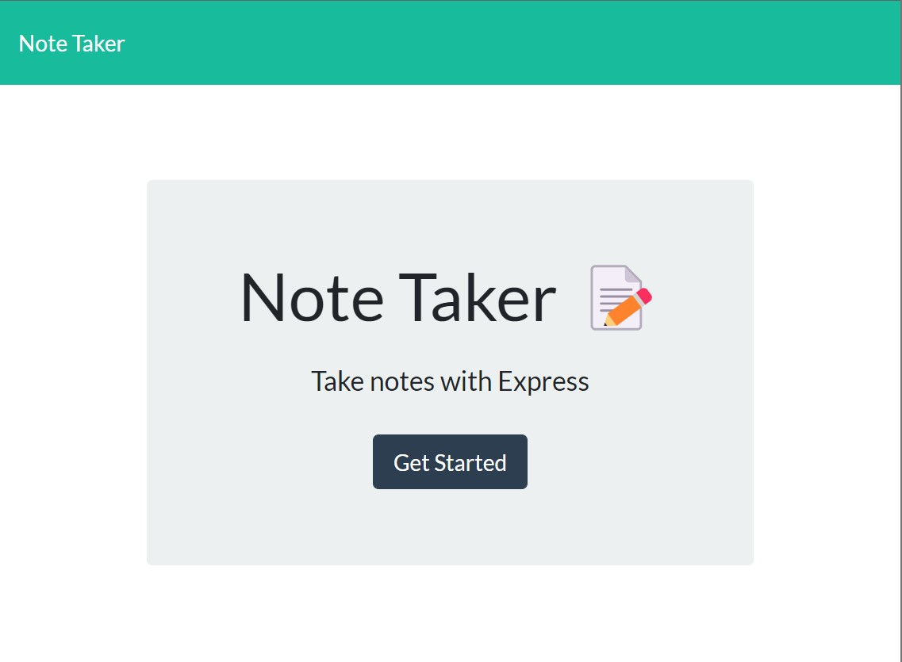
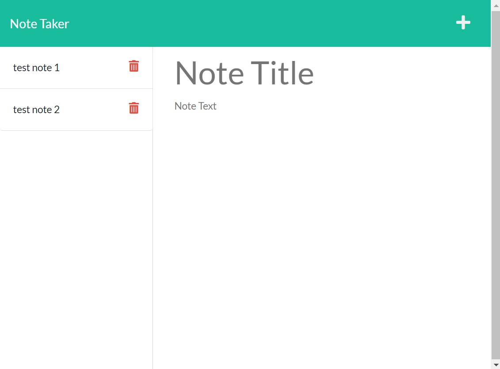

# Note Taker
  
  
  
  
  
  
  
 

  ## Description

  ----------------------

  This project is a simple note taking app that uses an API in order to store the notes entered by the user. The back-end uses Node.js and Express.js in order to set up a server to allow for persistence storage. Each note is also stored with a unique ID. Heroku is used to deploy the live site. 

  [Click Here](https://mighty-reef-15447.herokuapp.com/) to visit the live site.

  
  

  
  
  

   
 ## License

  -----------------------

  MIT License 

  Copyright (c) [2022] by [Lauren Yoder]

  [Click Here](https://choosealicense.com/licenses/mit/) to go to license details